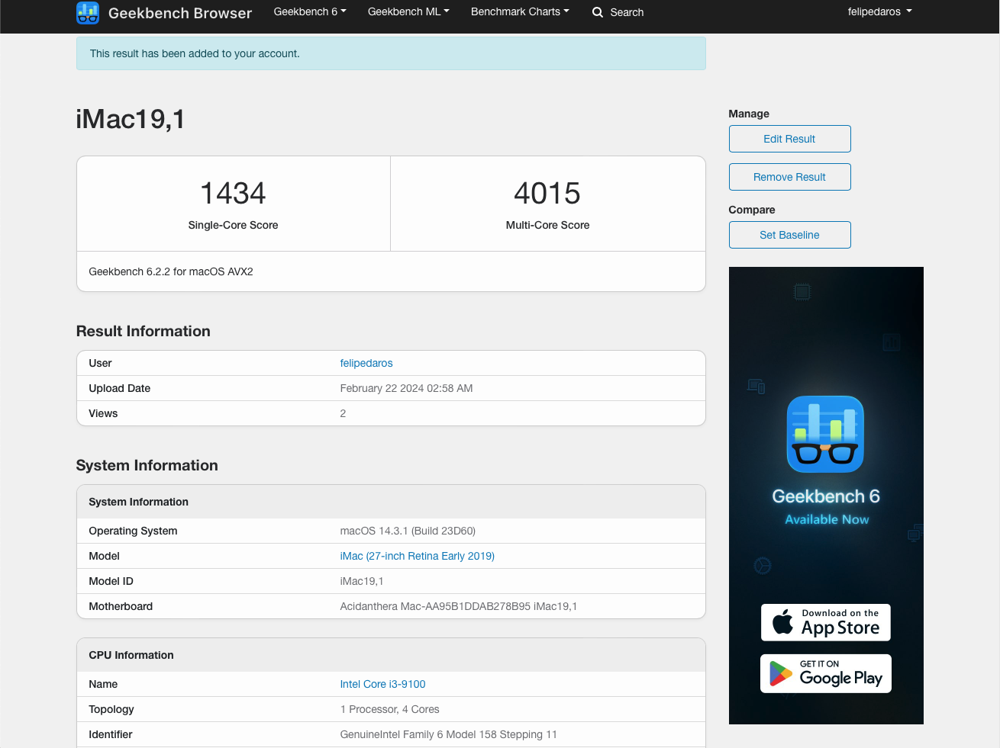
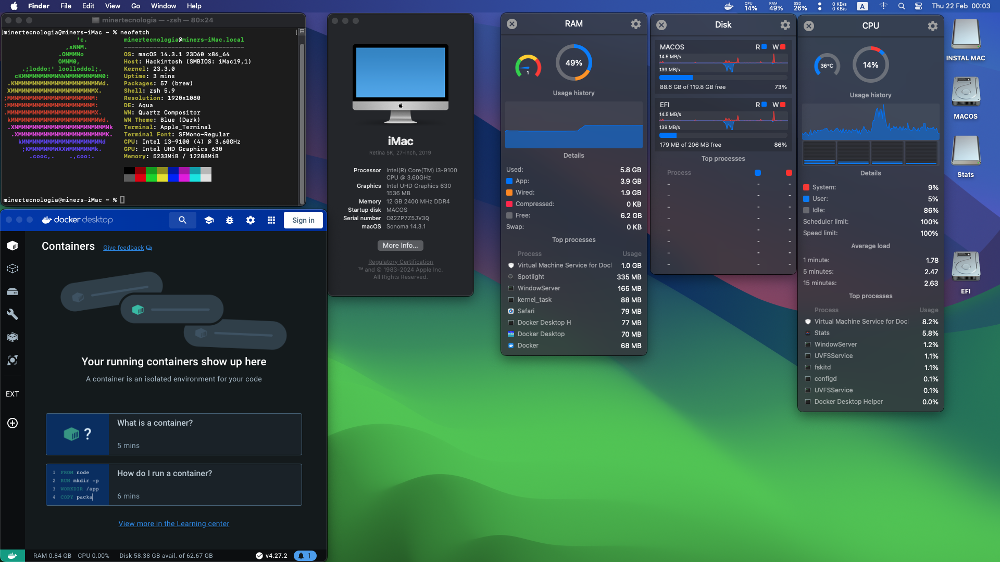

# Processador i5 91000 UHD GRAPHICS 630

# EFI Details
**Latest working macOS**: 14.3.1
 
**Current OpenCore**: 0.9.8
 
**Release date**: 01/03/2024

# Computer specifications
|Item|Description|
|-|:-------:|
||/
|Mobo|ASROCK H310CM-HG4 DDR4 LGA1151|
|CPU|Intel(R) Core(TM) i5-9100
|Memory|12GB DDR4 (16Gx1) 2400MHz|
|Storage|SATA KINGSTON 120GB|
|Ethernet|Intel's AND Realtek's 2.5Gb Ethernet.

# BIOS Settings

### Disable
- Fast Boot
- Secure Boot
- Serial/COM Port
- Parallel Port
- VT-d (can be enabled if you set `DisableIoMapper` to YES)
- Compatibility Support Module (CSM).
- Thunderbolt(For initial install, as Thunderbolt can cause issues if not setup correctly)
- Intel SGX
- Intel Platform Trust
- CFG Lock (MSR 0xE2 write protection)
	- This must be off, if you can't find the option then **`ENABLE`** `AppleXcpmCfgLock`. 
	- Your hack will not boot with `CFG-Lock` enabled.

### Enable
- VT-x
- Above 4G decoding. 
	- This must be on, if you can't find the option then add `npci=0x2000` to `boot-args`. 
	- Do not have both this option and `npci` on `boot-args` enabled at the same time.
- Hyper-Threading
- Execute Disable Bit
- EHCI/XHCI Hand-off
- OS type: Windows 8.1/10 UEFI Mode
- DVMT Pre-Allocated(iGPU Memory): 64MB
- SATA Mode: AHCI

# References
https://www.youtube.com/@UniversoHackintosh/featured
 
https://discord.universohackintosh.com.br